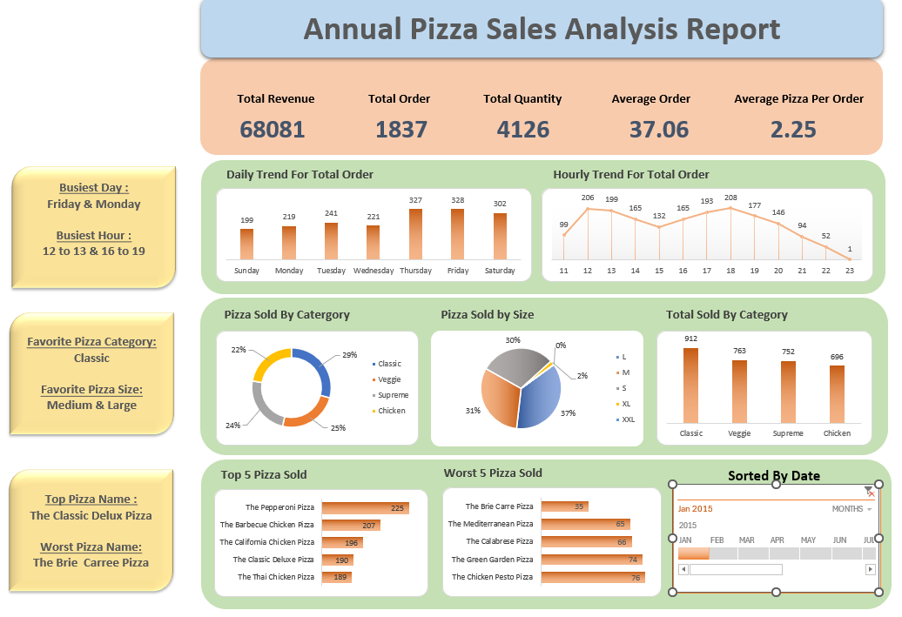

# Pizza Sales Analysis

This project showcases an analysis of a pizza sales dataset using Excel and SQL, leveraging tools such as Power Query, PivotTables, and Excel's data visualization features. The analysis focuses on key performance indicators (KPIs), trends, and sales insights across various dimensions, culminating in an interactive and dynamic dashboard.

## Project Overview

The goal of this project is to extract valuable insights from the pizza sales data and present them in an easily understandable format, helping to inform business decisions.

### Key Objectives:
- Calculate important KPIs, including:
  - **Total Revenue**
  - **Total Orders**
  - **Total Quantity Sold**
  - **Average Order Value**
  - **Average Pizza Quantity per Order**
- Analyze **daily and hourly sales trends** to identify peak business hours and high-revenue days.
- Perform a **sales analysis by pizza category and size** to understand customer preferences.
- Identify the **Top 5 and Worst 5 pizzas by sales** performance.
- Build an **interactive and dynamic dashboard** for real-time insights and business monitoring.

## Tools & Techniques Used

- **Excel**: Power Query for data cleaning and transformation, PivotTables for analysis, and data visualization features for creating an interactive dashboard.
- **Power Query**: To clean and standardize data formats, especially inconsistent date formats.
- **PivotTables**: For quick aggregation and slicing of sales data to generate KPIs and sales insights.
- **Excel Charts**: Used to create visualizations for trends, categories, and pizza performance.
- **Sql**: Used to cross validate the analysis

## Challenges

- **Inconsistent Date Formats**: The dataset contained multiple date formats, which required extensive cleaning and standardization using Power Query.

## Insights Delivered

- A comprehensive sales dashboard displaying:
  - **KPIs** for total revenue, total orders, and average metrics.
  - **Daily and hourly trends** to highlight peak periods.
  - **Pizza category and size preferences** to drive product strategy.
  - **Best and worst-performing pizzas** to guide marketing and product discontinuation decisions.

## Dashboard Preview

## How to Use

To explore the dashboard:
1. Download the Excel file from this repository.
2. Open the file in Excel.
3. Use the slicers and filters to interact with the data and explore the visualizations.
4. Also you can check the sql cross validation code.

## Conclusion

This project highlights the power of Excel in performing data analysis and visualization. By examining pizza sales through key metrics and trends, the analysis offers actionable insights to improve sales strategies and operational efficiency.
